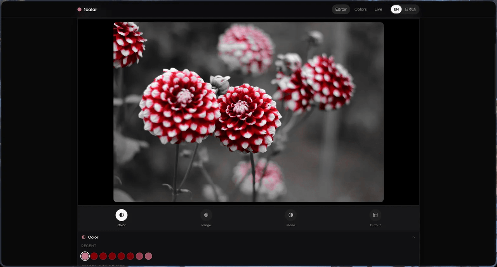
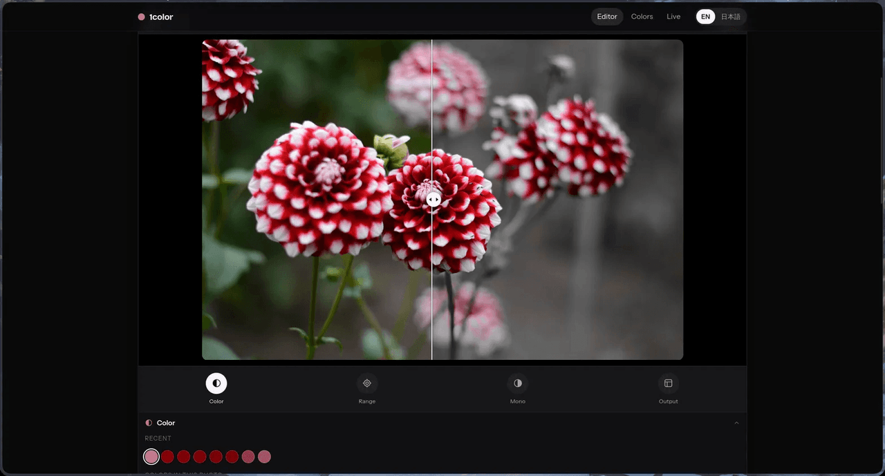

<p align="center">
  
</p>

<h1 align="center">
  <a href="https://1color.mhankbarbar.dev">1color</a>
</h1>

<p align="center">
  Tap a color in a photo and it stays. Everything else falls to black and white.
</p>

<p align="center">
  A selective-color editor that runs entirely in the browser. No account, no
  upload, no backend: the photo is processed on your GPU and never leaves the
  device.
</p>

<p align="center">
  
  
</p>

## Features

- **Pick by tapping or dragging** across the photo, with a magnifier showing the
  pixels under your pointer
- **Color range and edge feather** sliders — how wide a band of color survives,
  and how softly it ends
- **Apply to the whole photo or part of it**, using a circle, square, lasso, or
  brush with a live size indicator
- **Recent colors** kept alongside the palette read out of the photo itself
- **Monochrome tone**: four presets (Standard, Soft, Deep, High) plus tone and
  contrast
- **Before/after comparison** with a draggable divider
- **Export** at a chosen aspect ratio and resolution, with an optional frame
  (none, white, black, accent, custom) and margin, and optional swatch, color
  code, and color-mix overlays
- **Live camera mode** applying the same effect to the video feed, with capture
  straight into the editor
- **English and Japanese**, English by default

## Running it

```bash
npm install
npm run dev
```

Open the URL it prints. To build and serve the production bundle:

```bash
npm run build
npm run preview
```

## Tests

```bash
npm test
```

The suite covers the color matcher, export geometry, the mask layer, the shader
wiring, and the load ordering guard.

Two invariants are worth knowing about, because they are easy to break:

- `src/lib/color.js` is a **CPU mirror** of the fragment shader in
  `src/lib/shaders.js`. The tests assert the two agree numerically. Change the
  shader, and you must update the transcription in `src/lib/color.test.js`.
- The shader ships in **two dialects**, ES 3.00 for WebGL2 and ES 1.00 for
  WebGL1. `src/lib/gl.test.js` checks both, so neither device class can silently
  lose a control.

## How it works

| File | Role |
| --- | --- |
| `src/lib/shaders.js` | The fragment shader, in both ES 3.00 and ES 1.00 dialects. |
| `src/lib/gl.js` | Renderer: context setup, WebGL2 to WebGL1 fallback, draw calls. |
| `src/lib/color.js` | CPU mirror of the shader math, plus hex, contrast, and palette utilities. |
| `src/lib/mask.js` | The region mask layer and shape hit-testing. |
| `src/lib/analysis.js` | Reads the photo: tap sampling, coverage, the photo's own palette. |
| `src/lib/export.js` | Full-resolution export: frame, margin, ratio, and overlays. |
| `src/lib/loadGate.js` | Discards a slow load that would otherwise overwrite a newer one. |
| `src/lib/i18n.js` | English (default) and Japanese strings. |
| `src/components/` | `Stage` (canvas and region editing), `Editor` (tool panels), `Live` (camera). |

The color match is a **hue** distance computed in linear light, gated by
saturation. Linear light matters: gamma-encoded hue shifts as a color darkens, so
a sunflower's shaded petals would drift away from its lit ones and the subject
would only survive where it is brightest. Tapping a neutral color, such as a gray
sky, degrades to a brightness match, since a neutral has no hue to match against.

## Deploying

A static SPA — `dist/` is served as-is.

```bash
npm run build
npx wrangler pages deploy dist --project-name 1color --force
```

`--force` is required on Cloudflare Pages under wrangler 4, which otherwise
delegates to Workers and fails looking for a Worker entry-point.

Served at **https://1color.mhankbarbar.dev**, with `1color.pages.dev` as the
Cloudflare-assigned fallback. The custom domain needs a proxied `CNAME` for
`1color` pointing at `1color.pages.dev` in the zone's DNS.

For a Git-connected Pages project, use build command `npm run build` and output
directory `dist`.

## Browser support

WebGL2 where available, WebGL1 otherwise. The fallback is not theoretical: Chrome
on Android blocklists WebGL2 on a number of Adreno and Mali drivers.

Live camera mode needs `getUserMedia`, which requires a secure context, so
`localhost` or HTTPS.

## Credits

Sample photos, all from Wikimedia Commons:

- Sunflowers — Bruce Fritz, USDA. Public domain.
- Blue Door, White Wall — Klearchos Kapoutsis. CC BY 2.0.
- Red lanterns, Taiwan Lantern Festival — Pascal Terjan. CC BY-SA 2.0.

Display type is Bricolage Grotesque and body text is Instrument Sans, both from
Google Fonts. If that host is unreachable, the app falls back to Hiragino Sans,
Yu Gothic, or the system UI font.

## Not affiliated with Accent

1color was inspired by [Accent — Selective Color](https://apps.apple.com/jp/app/accent-selective-color/id6801496954),
an iOS app by AKIRA SANO. That is a separate project by a different developer.
This one is unaffiliated, and shares no code or assets with it.

## License

MIT
